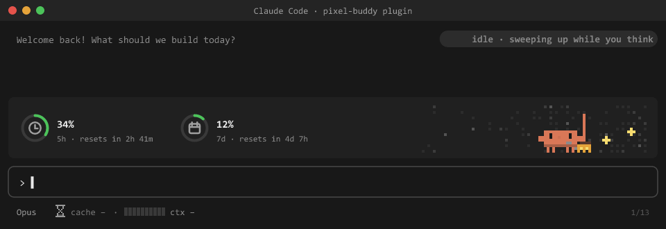

# clawd-hud — a pixel-art Claude for Claude Code



A Claude Code plugin that puts a tiny animated Claude mascot above the prompt, next to your usage rings, and adds a prompt-cache timer and a context meter beside the model picker. It works on personal plans and on enterprise seats.

## What it shows

**Above the prompt (the `AbovePrompt` band)**
- **Usage rings** for your plan's limits. Green below 70%, amber from 70%, red from 90%, plus a "resets in …" countdown:

| | Personal (Pro / Max) | Enterprise |
|---|---|---|
| Rings | `5h` window, `7d` weekly | `7d` weekly, `mo` monthly spend cap (can pass 100%) |
| Cost | not shown | `$` spent this session |
| "resets in" | the API's reset time | the API's reset time; for the spend cap without one, the 1st of next month |
| Cache timer (`auto`) | 1 hour | 5 minutes |

- **The mascot**. Its mood follows what Claude is doing:

| Mood | When | Scenes |
|---|---|---|
| `idle` | waiting for you | sweeping, walking with a butterfly, phone, chatting, reading |
| `working` | a turn is running | laptop, flying papers, dispatching sub-agents, carrying boxes, office, charts |
| `working` > 90s | a hard task | a smoke break joins the rotation |
| `loop` | the same tool with the same input 3× in one turn | a roller-coaster loop it can't get out of |
| `done` | the turn answered | confetti and a dance (a 💡 eureka bulb if the turn was hard) |
| `relax` | 4 min after `done` | sunset chair, fishing, hammock, campfire, barbecue, sunset drive |
| `error` | API error or refusal | a short puzzled beat, then idle |

**Beside the model picker (the `SessionMode` slot)**
- **Prompt-cache hourglass**: counts down the cache TTL from the last response, then shows "cold".
- **Context meter**: how full the context window is, e.g. `ctx 34% · 68k/200k`.

In a terminal (which can't draw SVG) the same readings show up as a text face `(o_o)` and block bars. A one-line summary also goes to the status bar.

## Install

```text
/plugin marketplace add Amitro123/claudemod
/plugin install clawd-hud@clawd-hud
```

## Options

Set with `claude plugin configure clawd-hud@clawd-hud`, or in the plugin settings:

| Option | Values | Default | What it does |
|---|---|---|---|
| `plan` | `auto`, `personal`, `enterprise` | `auto` | Which limits to show. `auto` switches to enterprise as soon as the account reports a monthly spend limit (`spend_limit`). |
| `cacheTtl` | `auto`, `5m`, `1h` | `auto` | The cache timer's length. `auto` is 1h on personal plans and 5m on enterprise. |

## How it works

- `hooks/register.tsx` hooks `session.start`, `session.measure`, `turn.start`, `tool.call`, `turn.complete` and `ui.render`. It keeps its state in atoms (`mood`, `moodAt`, `cacheAt`, `ctx`, `limits`, `loopSince`…) and runs a 150 ms frame clock.
- `hooks/scene.ts` draws one still SVG frame for a mood at time `t`. It uses a 100×18 pixel grid of `<rect>`s and evaluates CSS-like keyframe tracks itself, so a re-render never restarts an animation.
- `tests/plan.test.tsx` checks the personal and enterprise views and both cache timers. Run it with `claude plugin test plugins/clawd-hud`.

## Changes in 0.5.0

- **Renamed** from `pixel-buddy` to `clawd-hud`. Install it again with the commands above; settings saved under the old name do not carry over.
- **Enterprise mode** (see the table above), detected automatically or set with the `plan` option.
- **`tool.call` can't block tools.** The loop detector now has a registration-level `.catch`, so if it fails or overruns its budget the tool call still goes through.
- **The eureka bulb no longer clips** at the top of the band during the dance.

## Fixes in 0.4.1

- **Refusals were celebrated.** A turn that ended in a refusal played the confetti party, and could also show the eureka bulb. Now only a real answer celebrates, and a refusal gets the puzzled beat.
- **The scene could jump to the smoke break.** If the band showed "working" before `turn.start` had run, the elapsed time was measured from the Unix epoch, so the mascot went straight to the smoke break. It now uses a bounded free-running clock.
- **The cache countdown could freeze.** If the 1 s tick came late (for example after the laptop slept), the countdown could stay stuck on a stale "warm" value. Now it always flips to "cold".
- **Timers could stack up.** `session.start` can fire again (enable, worker respawn) and armed duplicate intervals each time. The previous timers are now cancelled first.
- **"resets in NaNm".** An unparsable `resetsAt` produced this text. It now shows `–`.
- **Scene index out of range.** A float edge case in the scene rotation could index past the end of the list. The index is now clamped.
- **Strict-mode type errors.** `scene.ts` now type-checks under `noUncheckedIndexedAccess`. The hourglass's local `frame` variable no longer shadows the `frame` atom.

## Regenerating the GIF

The GIF is rendered from the plugin's real `scene.ts`, so it is not a mock-up of the art:

```bash
cd demo
npm install
node render-frames.mjs   # needs Node ≥ 22.18 or ≥ 23.6 (runs scene.ts with built-in type stripping)
python make-gif.py       # needs Pillow
```
